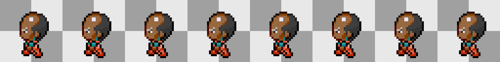

# Art for *Top Down Sprite Maker*

This repository is intended to house the sprite assets for [*Top Down Sprite Maker*](https://github.com/jbunke/tdsm), my pixel art character creation tool. It contains finished assets as well as project workspaces with content that is still work-in-progress.

I make TDSM assets with [*Stipple Effect*](https://github.com/stipple-effect/stipple-effect), a my scriptable pixel art editor. Thus, WIP project files are in the `.stip` file format.

Contributions from enthusiastic pixel artists are welcome -- please see the [**Contributing** section below](#contributing).

***Happy pixel pushing!***



## Folder structure

Most folders in this repo's root are associated with a **sprite style**. This is the general folder structure within each sprite style folder:

> Generic folder names are enclosed in square brackets `[]` and repeatable generic folders are appended with a `+` to indicate that there may be multiple of them in their parent folder.

```
(root)
|---- _tdsm
|---- [style_folder]+
|     |---- bases
|     |     |---- [layer_folder]+
|     |---- palettes
|     |---- scripts
|     |---- study
|     |---- workspaces
```

* `bases` -- Contains finished base assets. **Base assets** are customization elements drawn in a color-agnostic way that are modified at runtime by *TDSM* based on user customization input.
  * `[layer-folder]` -- Sprites inside `bases` are organized in folders according to their layer. Common layer names may include `head`, `body`, `eyes`, `torso`, `hair-back`, etc.
* `palettes` -- *Stipple Effect* color palettes; generally replacement palettes for different sprite components such as skin, hair, eyes, or clothes
* `scripts` -- *Stipple Effect* scripts to assist in preparing base sprites, such as color replacements, UV mappings, animating texture atlases, etc.
* `study` -- References. These files do not end up as *TDSM* resources.
* `workspaces` -- *Stipple Effect* projects that are used to make base assets.

## Contributing

<!-- TODO, _contrib folders (at root, in layer folders) -->

[**\[ Contribution Guide \]**]()

## To-Do List

<!-- TODO - link -->
If you want to contribute but are unsure of where to start, check out the [to-do list](). This is the list of high-priority sprite styles, animations, or customization options that need to be drawn.
