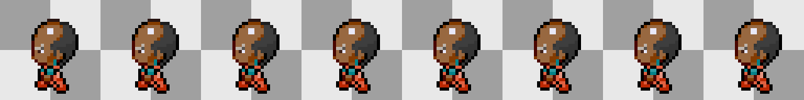

# Art for *Top Down Sprite Maker*

This repo houses logos, banners, promotional images and miscellaneous media for [*Top Down Sprite Maker*](https://github.com/jbunke/tdsm), my pixel art character creation tool.

I make TDSM assets with [*Stipple Effect*](https://github.com/stipple-effect/stipple-effect), a my scriptable pixel art editor. Thus, WIP project files are in the `.stip` file format.

